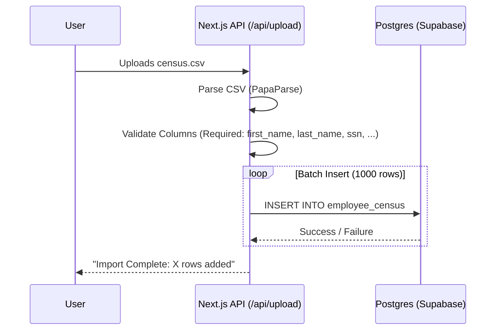

# 02 - API Data Flow & Logic Cycles

This document details the exact lifecycle of data within the ACA-1095 Builder, from initial CSV import to final IRS code generation.

## 1. Data Import Workflow

The system accepts CSV uploads to populate the **Census** and **Plan** data.

**Key Logic:**
*   **Idempotency**: The system currently uses `UPSERT` (Insert or Update) based on `employee_id` and `company_code`. Re-uploading the same file updates records rather than creating duplicates.
*   **Dependents**: `employee_dependent` table linking is crucial for "Self-Insured" coverage reporting (Part III of 1095-C).

---

## 2. Interim Data Generation (`generate_aca_monthly_interim`)

Before we can calculate tax codes (Line 14/15/16), we must normalize the data into a "Month-by-Month" view. An employee might be hired in March and fired in October; the interim tables expand this single census row into 12 monthly rows.

**Function:** `generate_aca_monthly_interim(company_code, year)`
**Target Tables:** `aca_employee_monthly_status`, `aca_employee_monthly_offer`, `aca_employee_monthly_enrollment`

**Step-by-Step Flow:**
1.  **Clear Old Data**: Delete existing interim records for this Company + Year.
2.  **Generate Status (Loop 1-12)**:
    *   For each month, check: Was the employee active? ( `hire_date <= month_end` AND `term_date >= month_start`).
    *   Check: Were they Full-Time? (Based on `pay_rate` or explicit status).
    *   Check: Age (for dependent eligibility logic).
3.  **Generate Offers (Loop 1-12)**:
    *   Look at `employee_plan_eligibility`.
    *   If eligible in Month X => Set `offer_of_coverage = TRUE`.
    *   **CRITICAL**: Determine `is_eligible_emp`, `is_eligible_spouse`, `is_eligible_child` based on the Plan Master configuration joined with the Eligibility record.
4.  **Generate Enrollment (Loop 1-12)**:
    *   Look at `employee_plan_enrollment`.
    *   If enrolled => Set `enrolled_in_coverage = TRUE`.
    *   Calculate **Cost** joined from `plan_enrollment_cost`.

---

## 3. Final Report Generation (`generate_aca_final_report`)

This is the core business engine. It translates the "Interim" monthly facts into IRS Codes.

**Function:** `generate_aca_final_report(company_code, year)`
**Target Table:** `aca_final_report`

### Line 14 Logic (Offer of Coverage)
The SQL `CASE` statement evaluates in this specific order (priority matters):

| Code | Condition | Meaning |
| :--- | :--- | :--- |
| **1H** | No Offer OR Not MEC (Minimum Essential Coverage). | User offered nothing, or a "Mini-Med" plan that doesn't count. |
| **1A** | Qualifying Offer. | Full-Time + MEC + MV + Affordable (<= $9X.XX) + Offered to Spouse/Child. |
| **1E** | Family Offer (Unaffordable). | Offered to Family, but cost > Affordable Threshold. |
| **1B** | Employee Only. | Result of specific valid offer combinations. |
| **1C** | Employee + Children. | Result of specific valid offer combinations. |
| **1D** | Employee + Spouse. | Result of specific valid offer combinations. |

### Line 16 Logic (Safe Harbors)
This explains *why* the employer is not penalized if Line 14 indicates no offer or unaffordable offer.

| Code | Condition | Meaning |
| :--- | :--- | :--- |
| **2A** | Not Employed. | Employee wasn't working this month. |
| **2B** | Not Full-Time. | Part-time employees don't trigger penalties. |
| **2C** | Enrolled. | Employee accepted the offer (regardless of cost). |
| **2F** | W-2 Safe Harbor. | Coverage was affordable based on W-2 wages Form W-2. |
| **BLANK** | **exposure**. | Potentially Triggering a Penalty! |

---

## 4. Penalty Analysis (`generate_aca_penalties`)

Calculates potential IRS liability based on `aca_final_report`.

*   **Penalty A ($2,900/yr - indexed)**: Triggered if "No Offer" (1H) is given to >5% of Full-Time employees.
    *   *Logic*: Count (Full-Time Employees with Code 1H AND No Safe Harbor).
*   **Penalty B ($4,350/yr - indexed)**: Triggered if an employee receives a Premium Tax Credit because coverage was unaffordable or not Minimum Value.
    *   *Logic*: Count (Full-Time Employees with Code != 1H AND Cost > Threshold AND No Safe Harbor).

**Note**: The system currently uses generalized "placeholder" values ($50 affordability, $241.67 monthly penalty) for estimation. **See Compliance Documentation for limitations.**
